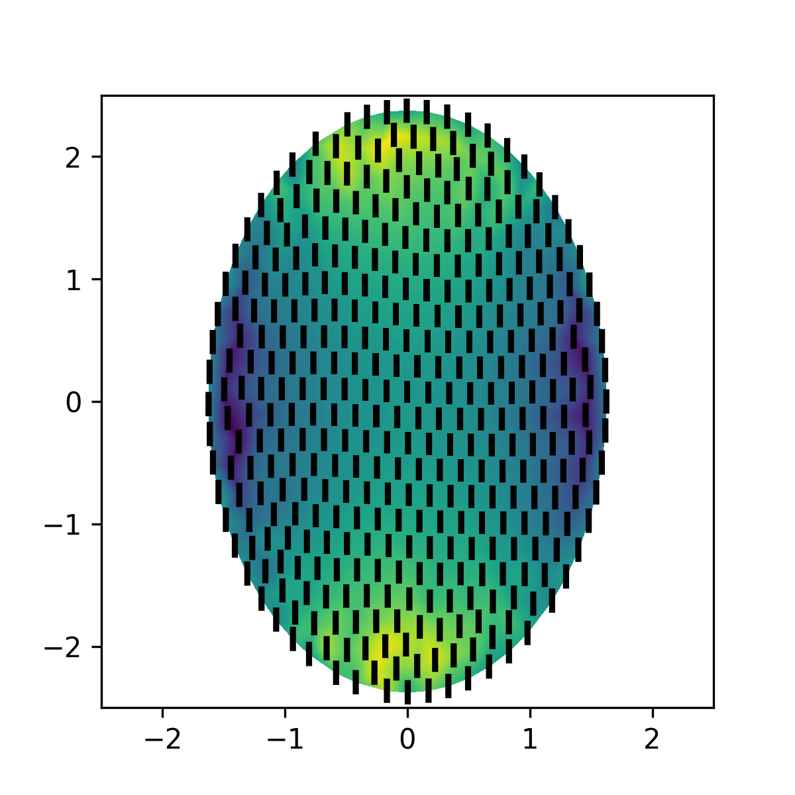

# Anabfem

<p align="center">

</p>

## Summary
This small python project provides tools for the **finite element analysis of annular ablation experiments**. It includes the packages:

1. **fem**: containing the object `FEM2DActiveElastic`. This object uses a triangular mesh (either provided by the user or loaded from the set of meshes included in the package) to calculate the tissue recoil after ablation assuming the tissue behaves as a 2D active, linear elastic solid adhered to a substrate via elastic bonds. Model parameters (bulk modulus, active tensions and adhesion strength, all relative to the shear modulus) are provided by the user to compute the solution. The solution can be plotted with matplotlib with the plot method (see examples below). It can also be exported in a vtk format, which can be loaded in Paraview for visualisation and further manipulation. 
2. **optimization**: containing the object `ParameterOptimizer`. This object uses `FEM2DActiveElastic` and user-provided data to fit the model parameters. The fit is performed via the `optimize()` function, which works as a wrapper for the [`minimize()` function of Scipy](https://docs.scipy.org/doc/scipy/reference/generated/scipy.optimize.minimize.html) with a target function that minimises differences between experiment data and fem simulations in a least-squares sense; all parameters accepted by Scipy `minimize()` can be provided to `optimize()`. Data is provided in a csv file and may contain tissue displacements (such as cell centre  displacements, or vertex displacements if the tissue has been triangulated), as well as tissue stretching and shear (if, for instance, one measures independently cell centre positions and their stretching and shear). The package also contains the `bootstrap()` method for a bootstrapping analysis of the best fitting parameters, which can be used for determining a confidence interval for them. Several experimental files can be given to `ParameterOptimizer` to fit the best parameters to all of them; this is especially useful if one of the parameters (for instance, the bulk modulus) does not change with time. 

## Installation

To install this package, download the package either by cloning it using git or by downloading a zipped version. In the terminar, go to the folder containing the poackage (you may need to unzip it if you downloaded the zipper version) and execute

```bash
python -m pip install .
```

This will automatically install the different dependencies (numpy, scipy, vtk) required by Anabfem.

## Usage

1. Finite element solution given a set of parameters:
```python

from anabfem.fem import FEM2DActiveElastic
import numpy as np

# Initialise the object (lintrans transforms the initial circle to a circle os radius 2)
fem = FEM2DActiveElastic("circle_0.vtk", lintrans=np.array([[2.0, 0.0],[0.0, 2.0]]))
fem.parameters = [0.1, 0.4, -0.4, 1.0] # [k, \zeta_x, \zeta_y, \bar{K}]/K
# Compute FEM solution
fem.update_mesh_displacements(True, True) # Compute displacement (and stretch and shear)
fem.save_vtk("solution.vtk") # Save in vtk format (to open in Paraview, for instance)

# Plot it with matplotlib
import matplotlib.pyplot as plt
fig = plt.figure(figsize=(4,4))
ax = fig.add_subplot(111)
fem.plot(deformed=True, show_mesh=False, show_stretch=True, show_shear=True)
ax.set_xlim([-2.5,2.5])
ax.set_ylim([-2.5,2.5])
ax.set_aspect('equal')
plt.show()
```

<p align="center">

</p>


2. Optimise parameters given an experimental data set
```python
from anabfem.fem import FEM2DActiveElastic
from anabfem.optimization import ParameterOptimizer

# Data fileds
expfiles = ["data.csv"]

# Initialise the fem object
fem = FEM2DActiveElastic("circle_0.vtk", lintrans=np.array([[25.0, 0.0],[0.0, 25.0]]))

# Initialise the optimiser
opt = ParameterOptimizer(fem, expfiles, kdisp=1.0, kshear=1.0, kstretch=1.0)

# Optimise
opt.optimize()

# Print the parameters
print(opt.parameters)

# Update the fem object with the best parameters
fem.parameters = opt.parameters
fem.update_mesh_displacements(True, True)

#Plot it in matplotlib
import matplotlib.pyplot as plt
fig = plt.figure(figsize=(3,3))
ax = fig.add_subplot(111)
fem.plot(deformed=True, show_mesh=False, show_stretch=True, show_shear=True)
plt.show()
```
## Author
Alejandro Torres-Sanchez (Francis Crick Institute)

## License
